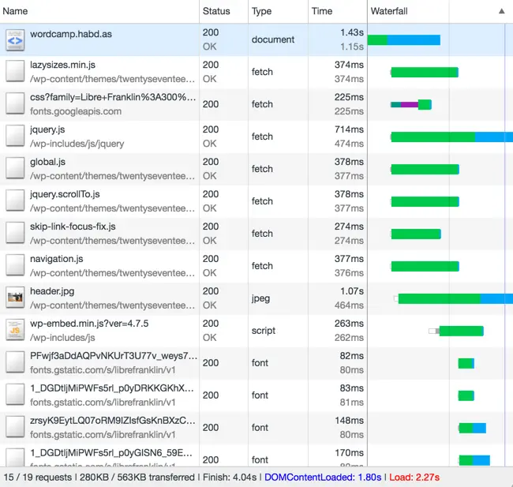
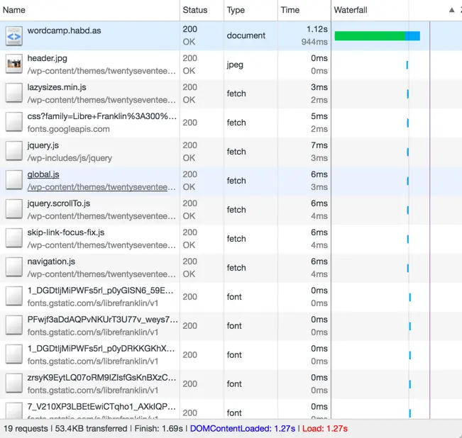

# Fetch Inject 

[](https://npmjs.com/fetch-inject)
[](https://npmjs.com/fetch-inject)
[](https://bundlephobia.com/package/fetch-inject)
[](https://www.jsdelivr.com/package/npm/fetch-inject)
[](https://codeberg.org/vhs/fetch-inject)

Dynamically inline assets into the DOM using [Fetch Injection](https://vhs.codeberg.page/post/managing-async-dependencies-javascript/).

Read the [**Hacker News discussion**](https://news.ycombinator.com/item?id=14380191).

## Overview 🌱

Fetch Inject implements a performance optimization technique called [Fetch Injection](https://vhs.codeberg.page/post/managing-async-dependencies-javascript/) for managing asynchronous JavaScript dependencies. It works for stylesheets too, and was designed to be extensible for any resource type that can be loaded using [`fetch`](https://devdocs.io/dom-fetch/).

Use Fetch Inject to dynamically import external resources in parallel (even across the network), and load them into your page in a desired sequence, at a desired time and under desirable runtime conditions.

Because it uses the [Fetch API](http://devdocs.io/dom/fetch_api) Fetch Inject works alongside [Service Workers](http://devdocs.io/dom-service-workers/) for creating offline-first, installable progressive web applications and saves bandwidth on metered networks.

## Playground 🛝

Try [CodePen Playground](https://codepen.io/vhsdev/pen/QWOoJqG?editors=0012) while referencing the [Use Cases](#use-cases-) provided below.

## Performance ⚡️

The two following network waterfall diagrams were produced using Fetch Inject to load the WordPress Twenty Seventeen theme for a performance talk given at WordCamp Ubud 2017. Stats captured over a 4G network using a mobile Wi-Fi hotspot. The left-hand side shows page speed with an unprimed browser cache and the other using Service Worker caching.

<p>
  
  
</p>

Notice with Service Workers (right) most latency occurs waiting for the initial response.

## Installation 💾

```sh
pnpm add fetch-inject # or yarn, npm i, etc.
```

For asset pipelines requiring UMD, AMD or CJS check out version 2 and below.

## Usage 🌀

    Promise<Object[]> fetchInject( inputs[, promise[, fetch]] )

### Parameters

<dl>
<dt>inputs<dd>Resources to fetch. Must be an <code>Array</code> of type <a target="devdocs" href="http://devdocs.io/dom/usvstring"><code>USVString</code></a> or <a target="devdocs" href="http://devdocs.io/dom/request"><code>Request</code></a> objects.
<dt>promise<dd>Optional. <a target="devdocs" href="http://devdocs.io/javascript/global_objects/promise"><code>Promise</code></a> to await before injecting fetched resources.
<dt>fetch<dd>Optional. Fetch implementation to use for requests.
</dl>

### Return value

A [`Promise`](http://devdocs.io/javascript/global_objects/promise) that resolves to an `Array` of `Object`s. Each `Object` contains a list of resolved properties of the [`Response`](http://devdocs.io/dom/response) [`Body`](http://devdocs.io/dom/body) used by the module, e.g.

```js
[{
  blob: { size: 44735, type: "application/javascript" },
  text: "/*!↵ * Bootstrap v4.0.0-alpha.5 ... */"
}, {
  blob: { size: 31000, type: "text/css" },
  text: "/*!↵ * Font Awesome 4.7.0 ... */"
}]
```

## Use Cases 🎯

[Use the Playground](#playground-) to try any of these on your own.

### Preventing Script Blocking

**Problem:**
External scripts can lead to [jank](http://jankfree.org/) or [SPOF](https://www.stevesouders.com/blog/2010/06/01/frontend-spof/) if not handled correctly.

**Solution:**
Load external scripts [without blocking](https://www.stevesouders.com/blog/2009/04/27/loading-scripts-without-blocking/):

```html
fetchInject([
  'https://cdn.jsdelivr.net/npm/flexsearch/dist/flexsearch.bundle.min.js'
])
```

This is a simple case to get you started. Don't worry, it gets better.

### Loading Non-critical CSS

**Problem:**
[PageSpeed Insights](https://developers.google.com/speed/pagespeed/insights/) and [Lighthouse](https://chrome.google.com/webstore/detail/lighthouse/blipmdconlkpinefehnmjammfjpmpbjk) ding you for loading unnecessary styles on initial render.

**Solution:**
Inline your critical CSS and load [non-critical styles](https://gist.github.com/scottjehl/87176715419617ae6994) asynchronously:

```html
<style>/*! bulma.io v0.4.0 ... */</style>
<script type="module">
fetchInject([
  '/css/non-critical.css',
  'https://cdn.jsdelivr.net/fontawesome/4.7.0/css/font-awesome.min.css'
])
</script>
```

See also [Suspense](#suspense) below.

### Lazyloading Scripts

**Problem:**
You want to load a script in response to a user interaction without affecting your page load times.

**Solution:**
Create an event listener, respond to the event and then destroy the listener.

```js
const el = document.querySelector('details summary')
el.onclick = (evt) => {
  fetchInject([
    'https://cdn.jsdelivr.net/smooth-scroll/10.2.1/smooth-scroll.min.js'
  ])
  el.onclick = null
}
```

Here we are loading the smooth scroll polyfill when a user opens a [details](http://devdocs.io/html/element/details) element, useful for displaying a collapsed and keyboard-friendly table of contents.

### Responding to Asynchronous Scripts

**Problem:**
You need to perform a synchronous operation immediately after an asynchronous script is loaded.

**Solution:**
You could create a `script` element and use the [`async`](http://devdocs.io/html/attributes#async-attribute) and `onload` attributes. Or you could...

```js
fetchInject([
  'https://cdn.jsdelivr.net/momentjs/2.17.1/moment.min.js'
]).then(() => {
  console.log(`Finish in less than ${moment().endOf('year').fromNow(true)}`)
})
```

### Ordering Script Dependencies

**Problem:**
You have several scripts that depend on one another and you want to load them all asynchronously, in parallel, without causing race conditions.

**Solution:**
Pass `fetchInject` to itself as a second argument, forming a promise recursion:

```js
fetchInject([
  'https://npmcdn.com/bootstrap@4.0.0-alpha.5/dist/js/bootstrap.min.js'
], fetchInject([
  'https://cdn.jsdelivr.net/jquery/3.1.1/jquery.slim.min.js',
  'https://npmcdn.com/tether@1.2.4/dist/js/tether.min.js'
]))
```

### Managing Asynchronous Dependencies

**Problem:**
You want to load some dependencies which require some dependencies, which require some dependencies. You want it all in parallel, and you want it now.

**Solution:**
You could scatter some `link`s into your document head, blocking initial page render, bloat your application bundle with scripts the user might not actually need. Or you could...

```js
const tether = ['https://cdn.jsdelivr.net/tether/1.4.0/tether.min.js']
const drop = ['https://cdn.jsdelivr.net/drop/1.4.2/js/drop.min.js']
const tooltip = [
  'https://cdn.jsdelivr.net/tooltip/1.2.0/tooltip.min.js',
  'https://cdn.jsdelivr.net/tooltip/1.2.0/tooltip-theme-arrows.css'
]
fetchInject(tooltip, fetchInject(drop, fetchInject(tether)))
  .then(() => {
    new Tooltip({
      target: document.querySelector('h1'),
      content: "You moused over the first <b>H1</b>!",
      classes: 'tooltip-theme-arrows',
      position: 'bottom center'
    })
  })
```

What about jQuery dropdown menus? Sure why not...

```js
fetchInject([
  '/assets/js/main.js'
], fetchInject([
  '/assets/js/vendor/superfish.min.js'
], fetchInject([
  '/assets/js/vendor/jquery.transit.min.js',
  '/assets/js/vendor/jquery.hoverIntent.js'
], fetchInject([
  '/assets/js/vendor/jquery.min.js'
]))))
```

### Loading and Handling Composite Libraries

**Problem:**
You want to deep link to gallery images using [PhotoSwipe](http://photoswipe.com/) without slowing down your page.

**Solution:**
Download everything in parallel and instantiate when finished:

```js
const container = document.querySelector('.pswp')
const items = JSON.parse({{ .Params.gallery.main | jsonify }})
fetchInject([
  '/css/photoswipe.css',
  '/css/default-skin/default-skin.css',
  '/js/photoswipe.min.js',
  '/js/photoswipe-ui-default.min.js'
]).then(() => {
  const gallery = new PhotoSwipe(container, PhotoSwipeUI_Default, items)
  gallery.init()
})
```

This example turns TOML into JSON, parses the object, downloads all of the PhotoSwipe goodies and then activates the PhotoSwipe gallery immediately when the interface is ready to be displayed.

### Suspense

**Problem:** You're experiencing a flash of unstyled content when lazy-loading page resources.

**Solution:** Hide the content until your styles are ready:

```js
const pageReady = new Promise((resolve, reject) => {
  document.onreadystatechange = () => {
    document.readyState === "complete" && resolve(document);
  };
});

fetchInject([
  'https://cdn.jsdelivr.net/npm/bootstrap@4.0.0/dist/css/bootstrap.min.css'
], pageReady).then(() => (document.body.style.visibility = 'visible'));
```

## SvelteKit

As of version 3.1.0 Fetch Inject supports use with SvelteKit. Use it inside your `load` functions to run Fetch requests client- and server-side. Or drop it inside your [hooks](https://kit.svelte.dev/docs/modules#sveltejs-kit-hooks) in order to inject resources into the document like so:

```js
export const handle: Handle = sequence(
  async ({ event, resolve }) => {
    const response = await resolve(event);
    const [flexsearch] = await fetchInject([
      'https://cdn.jsdelivr.net/npm/flexsearch/dist/flexsearch.light.min.js'
    ]);

    const body = await response.text();
    return new Response(
      body.replace('</body>', `<script>${flexsearch.text}</script></body>`),
      response
    );
  },
  /* snip */
}
```

The above will inject FlexSearch into every page on the site.

## Custom Fetch

Fetch Inject 3.0.0 quietly introduced a new feature allowing control the Fetch implementation used. SvelteKit provides its own server-side Fetch implementation, which you can now override when fetching resources with Fetch Inject:

```js
fetchInject([
  '/assets/scripts/crawlers.js',
], Promise.resolve(), { fetch: globalThis.fetch })
```

The above replaces the SvelteKit `fetch` implementation with native `fetch`.

## Supported Browsers 🔮

All browsers with support for [Fetch](http://caniuse.com/#feat=fetch) and [Promises](http://caniuse.com/#search=promises).

## Progressive Enhancement 🛟

You don't need to polyfill fetch for older browsers when they already know how to load external scripts. Give them a satisfactory fallback experience instead.

In your document `head` get the async loading started right away if the browser supports it:

```js
(function () {
  if (!window.fetch) return;
  fetchInject([
    '/js/bootstrap.min.js'
  ], fetchInject([
    '/js/jquery.slim.min.js',
    '/js/tether.min.js'
  ]))
})()
```

Then, before the close of the document `body` (if JS) or in the `head` (if CSS), provide the traditional experience:

```js
(function () {
  if (window.fetch) return;
  document.write('<script src="/js/bootstrap.min.js"><\/script>');
  document.write('<script src="/js/jquery.slim.min.jss"><\/script>');
  document.write('<script src="/js/tether.min.js"><\/script>');
})()
```

This is entirely optional, but a good practice unless you're going full hipster.

## Related Projects 🙏🏼

- [fetch](https://github.com/github/fetch) - Polyfill for `window.fetch`
- [promise-polyfill](https://github.com/taylorhakes/promise-polyfill) - Polyfill for Promises
- [es-module-loader](https://github.com/ModuleLoader/es-module-loader) - Polyfill for the ES Module Loader
- [isomorphic-fetch](https://github.com/matthew-andrews/isomorphic-fetch) - A library for using `fetch` in Node
- [Dynamic Imports](https://github.com/tc39/proposal-dynamic-import) - `import()` proposal for JavaScript
- [load-stylesheets](https://github.com/brettz9/load-stylesheets) - Promise-based stylesheet-loading via `<link>` tags
- [PreloadJS](https://github.com/CreateJS/PreloadJS) - Full-featured JS preloader using XHR2
- [Gluebert](https://gluebert.com) - Helper for lazy-loading DOM elements using `import()`

## WordPress Plugin 🚀

Fetch Inject has been built into a WordPress plugin, enabling Fetch Injection to work within WordPress. [Initial testing](https://hackernoon.com/putting-wordpress-into-hyperdrive-4705450dffc2) shows Fetch Injection enables WordPress to load pages **300% faster** than conventional methods.


Access the plugin from the [Hyperdrive repo](https://codeberg.org/vhs/hyperdrive) and see the related [Hacker Noon post](https://hackernoon.com/putting-wordpress-into-hyperdrive-4705450dffc2) for more details.

## Rights ⚖️

Fetch Inject - Dynamically inline assets into the DOM using Fetch Injection.<br>
Copyright (C) 2017-2019, 2022&nbsp;&nbsp;VHS &lt;vhsdev@tutanota.com&gt; (https://vhs.codeberg.page)

This software is provided 'as-is', without any express or implied
warranty.  In no event will the authors be held liable for any damages
arising from the use of this software.

See the file COPYING in the source for full license text.
